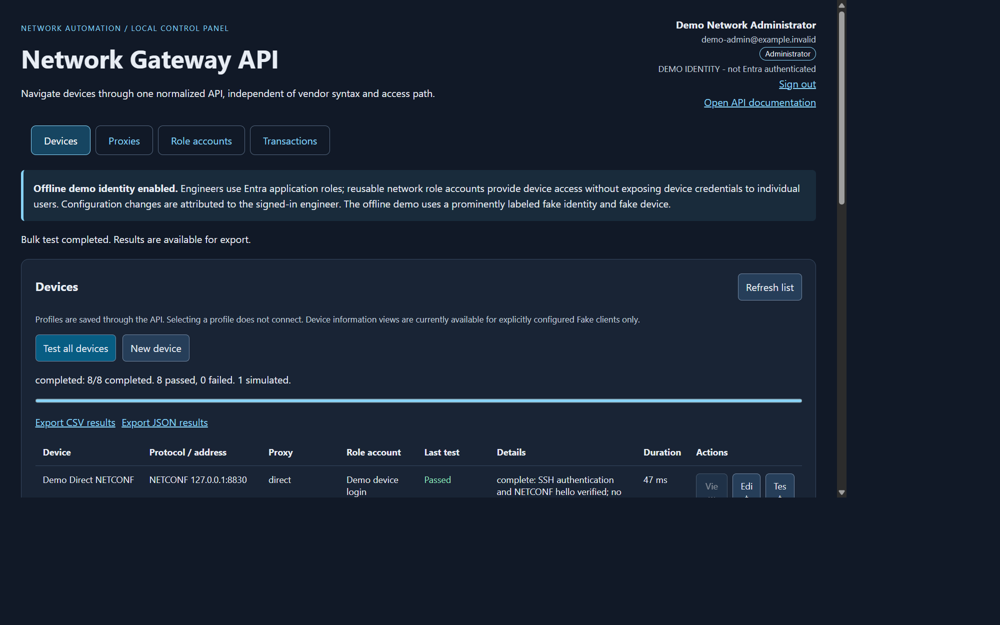
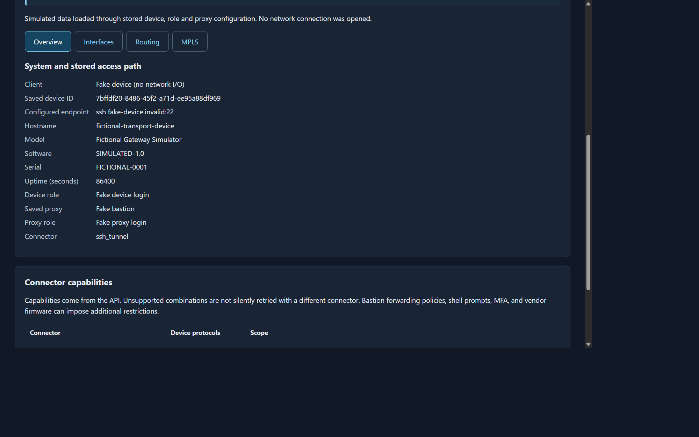
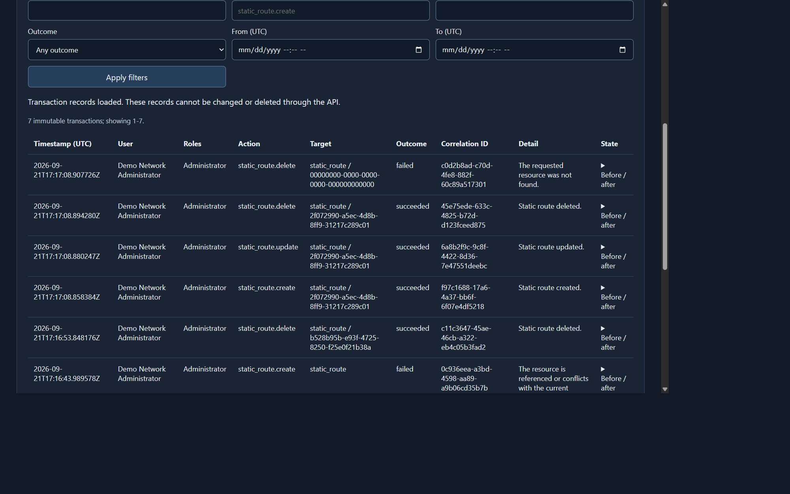

# Network Gateway API

An API-first Python control plane for navigating network equipment through a
consistent model, regardless of vendor syntax, protocol or access path. Vendor
clients translate SSH, NETCONF-over-SSH, custom-port Telnet and future platform
APIs into normalized device, interface, routing and statistics responses. A
lightweight browser UI uses the same REST API as automation clients.

The primary purpose is unified device navigation and operations. Connectivity
profiles, bastions and reusable network role accounts are supporting
infrastructure: engineers use the application rather than maintaining direct
device credentials and vendor-specific tribal knowledge.

The repository is published as
[`network-gateway-api`](https://github.com/OakyNam/network-gateway-api).
This is a **local administrator demo and development prototype**, not a
production deployment or a claim of verified compatibility with live vendor
equipment.

## What it demonstrates

- Explicit **UI / API / BL / DAL** boundaries.
- Persistent device profiles, reusable proxy profiles and reusable role accounts.
- Password or pasted SSH-private-key authentication, with an optional key
  passphrase. Role accounts are reusable network logins, **not application RBAC**.
- Configurable SQLite storage or a PostgreSQL SQLAlchemy backend; encrypted
  credential fields and encrypted bulk-test credential snapshots.
- Explicit connector selection, separate device/bastion credentials and trust,
  and no silent fallback to direct access.
- Individual connection tests and API-managed, failure-isolated bulk tests with
  progress and CSV/JSON result export.
- Real loopback protocol/proxy peers for network clients, plus an explicitly
  labeled fake device client for the inventory/static-route scaffold.
- A device-inventory landing page, separate New/Edit Device views, and navigation
  between Devices, Proxies and Role Accounts.
- Microsoft Entra ID application identity with Viewer, Operator and Administrator
  roles, plus user-attributed immutable transaction records for configuration
  changes. The offline demo uses an explicit fake identity instead of pretending
  to perform Entra authentication.

Only local emulator compatibility is demonstrated. No real vendor equipment,
external PostgreSQL server, hosted CI run or production deployment is implied.

## Demo screenshots

### Multi-transport connectivity



### Normalized device and access-path view



### Immutable configuration transactions



## Product model

The normalized API is intended to grow across:

- Device/system inventory and health.
- Interface configuration, operational state, counters and statistics.
- Global and private routing tables/VRFs.
- Static routes and BGP configuration.
- MPLS interfaces, LDP neighbors and label-switched paths.
- Audited configuration transactions.

Each vendor client owns native command syntax, prompts, RPCs, parsing and
capability limitations. API consumers receive stable normalized resources
instead of vendor-native output. Unsupported operations must fail explicitly;
adding a vendor name to a mapping does not imply that its commands are
implemented or verified.

Application users and network role accounts are deliberately separate:

| Identity | Purpose |
|---|---|
| Entra Viewer | Read normalized device data and transaction history |
| Entra Operator | Viewer access plus connection tests and supported device changes |
| Entra Administrator | Full application profile, proxy, role-account and mapping administration |
| Network role account | Encrypted credentials the gateway uses to access equipment or bastions |

Engineers never receive network role-account secrets from the API. Configuration
changes execute immediately in the first version and write immutable transaction
records containing the authenticated user, correlation ID, target, normalized
before/after state and outcome.

## Microsoft Entra ID setup

The gateway supports a single-tenant Entra web application. No Microsoft Graph
application permission is required for basic OIDC sign-in.

1. Create an Entra app registration for the gateway.
2. Add each exact callback URI used by the deployment as a **Web** redirect URI:
   - Local example: `http://localhost:8000/api/v1/callback`
   - Production example: `https://gateway.example.com/api/v1/callback`
3. Define app roles with values `Viewer`, `Operator` and `Administrator`, allowed
   for users/groups. Assign users or groups to the appropriate role.
4. Create a client secret for the server-side web application. Store it in the
   deployment secret store; never commit it or expose it to the browser.
5. Configure the environment variables shown in `.env.example`, including the
   tenant ID, application/client ID, exact redirect URI allowlist and secret.

The browser uses authorization code flow with PKCE. The server validates signed
tokens, issuer, tenant, audience, lifetime and application roles. A request-derived
callback URI must exactly match the configured allowlist. Production authentication
does not fall back to the demo user.

For offline portfolio demonstrations, explicitly set `GATEWAY_AUTH_MODE=demo`
and use the demo runner, which enables application demo mode. Selecting demo auth
without application demo mode fails closed. The UI labels this identity as fake.

## Quickstart: fake-credential loopback demo

From the repository root in PowerShell:

```powershell
python -m venv .venv
.\.venv\Scripts\python.exe -m pip install -r requirements-dev.txt
.\.venv\Scripts\python.exe -m demo.run_demo
```

To opt into a different local storage directory:

```powershell
.\.venv\Scripts\python.exe -m demo.run_demo --storage-dir "D:\gateway-demo-data"
```

The directory contains the management and legacy SQLite databases, generated
device/bastion trust files, a demo-only encryption key and seed bookkeeping.
Reuse the same directory and key on restart. The explicit CLI argument is
required for relocation; inherited production database/key settings are rejected,
not reused or silently overridden. Do not use an unrelated application's data
directory. Keep custom demo storage outside source control.

Seven network profiles demonstrate three direct protocols plus SSH forwarding,
SSH-shell Telnet, SOCKS5 and HTTP CONNECT. An eighth profile exercises the fake
device client through its own saved roles and proxy. In total, eight devices,
five proxies and four role accounts are seeded. Device peers use ports 8822 (SSH), 8830
(NETCONF) and 8023 (Telnet); proxy peers use 8823 (SSH forwarding), 8824 (SSH shell),
1080 (SOCKS5) and 8888 (HTTP CONNECT), all on loopback.

Open:

- Management UI: <http://127.0.0.1:8000/ui>
- API documentation: <http://127.0.0.1:8000/docs>
- Machine-readable specification: <http://127.0.0.1:8000/openapi.json>

The UI itself has no framework/CDN dependency. FastAPI's interactive documentation
uses CDN-hosted Swagger UI assets; `/openapi.json` remains available without them.

The demo uses fake credentials and persistent demo data, starts loopback
emulators, and retains strict SSH host-key verification. Startup rejects
conflicting inherited database/configuration settings before opening a database
or starting listeners. It must not be used to reach production equipment.
Stop it with **Ctrl+C** so the API worker and emulator sockets are shut down.

Initialization inserts missing demo records without overwriting saved edits.
Editing a seeded profile is persistent; changing its credentials or address can
therefore intentionally make its next test fail.

### Using the UI

1. The initial page lists configured devices. **Test all devices** starts a
   server-owned job, not a series of browser-owned connection attempts.
2. Select **New device**, or **Edit** in a row, for a separate device form.
   Selecting or saving a profile does not connect to the device.
3. In **Role accounts**, choose exactly one authentication method. A blank
   secret on an unchanged method preserves it; switching methods requires a
   new credential and removes the old one.
4. In **Proxies**, configure a reusable bastion/proxy and its own optional role
   account and trust file. Select that saved proxy in a device profile.
5. Run an individual test or a bulk job. A failed device does not stop the
   remaining devices. Export the finished run as CSV or JSON.

Results describe the saved configuration at test time, not ongoing monitoring.
Bulk jobs retain their original snapshot even if records subsequently change.
Passwords, private keys, passphrases and storage connection settings are never
returned to the UI. Server-local trust/key file paths are not browser uploads.

## Fake device: exercise every application layer

Select **View** on **Fake transport device**. Its Overview shows the persisted
device role, proxy and proxy role used for access. Other views include Interfaces,
Routing (BGP and Static routes), and MPLS (Interfaces, LDP neighbors and LSPs).

Only the device-side answers are fictional:

```text
Browser -> API -> business logic -> DAL/database
        -> saved connection + device role + proxy + proxy role
        -> fake device client -> simulated inventory or route operation
```

The database and reference resolution are real. The fake client checks the
resolved device and bastion endpoints and credentials before answering. Changing
either saved role's password or the saved proxy destination causes access to
fail; the API does not bypass those records or substitute a canned success.
Fake operations do not open device/proxy sockets.

The deliberately public fake access graph is:

| Record | Demo configuration |
|---|---|
| Fake device login | `fake-device-user` / `fake-device-password` |
| Fake proxy login | `fake-proxy-user` / `fake-proxy-password` |
| Fake bastion | SSH forwarding profile, `fake-bastion.invalid:22`, references Fake proxy login |
| Fake transport device | `client_type=fake`, SSH profile, `fake-device.invalid:22`, references Fake device login and Fake bastion |

These are intentionally fictional credentials, not production secrets. Passwords
are still encrypted in storage and redacted from ordinary API reads.

Static route create/edit/delete operations use the API and persist a separate
simulated route table for each device. Seed routes are initialized only once:
deleting the last route does not make it reappear on refresh. Edits survive a
database/process restart. Destination prefixes and next-hop address families are
validated; the scaffold supports one route per destination, not ECMP or vendor
configuration syntax. It does not check real next-hop reachability or change
network equipment.

`GATEWAY_DEVICE_DATA_PROVIDER` defaults to `disabled`; the demo explicitly sets
it to `fake`. A profile must also explicitly select `client_type=fake`. There is
no global fallback that makes network profiles return fictional inventory.
Network-profile inventory remains unsupported in this milestone, so its **View**
button is disabled. Network connection tests still use the real transports.

Single-test and bulk results, including CSV/JSON exports, carry a `simulated`
boolean. The UI labels simulated results rather than presenting them as real
network connectivity.

## Connector capabilities

| Connector | SSH | NETCONF | Generic Telnet | Behavior |
|---|---|---|---|---|
| Direct | Yes | Yes | Yes | Connect directly to the configured device port |
| SSH TCP forwarding (`ssh_tunnel`) | Yes | Yes | Yes | Authenticate to a bastion and open a TCP forwarding channel |
| Interactive SSH shell (`ssh_shell`) | No | No | Yes | Constrained jump-shell Telnet flow; requires compatible prompts/command |
| SOCKS5 (`socks5`) | Yes | Yes | Yes | SOCKS5 tunnel, with optional username/password authentication |
| HTTP CONNECT (`http_connect`) | Yes | Yes | Yes | HTTP CONNECT tunnel, with optional Basic proxy authentication |

The authoritative machine-readable matrix is `GET /api/v1/capabilities`.
Unsupported combinations fail explicitly. Device and bastion trust are checked
independently; a failed proxy does not trigger a direct-device retry.

**Important limits**

- Telnet and HTTP Basic proxy authentication are plaintext on their respective
  legs. Use only controlled networks or an appropriate protected tunnel.
- Interactive shell support is not universal jump-host, MFA, nested-hop or
  vendor-shell compatibility.
- Generic Telnet supports the demonstrated username/password prompt flow and
  configurable ports. Lucent DDM2200 compatibility has **not** been established;
  its actual login dialogue and supported commands need hardware-specific work.
- A connection test verifies the implemented authentication/protocol handshake,
  not every command, device feature, configuration write or vendor operation.
- The demo restricts connection-test destinations and trust-file access. It does
  not accept arbitrary remote destinations as a convenience fallback.

## API

Administrative writes use `Content-Type: application/json`, including empty
single-test POSTs. Cross-origin browser mutations are rejected. This protection
is not a substitute for authentication or authorization.

| Method | Path | Purpose |
|---|---|---|
| GET | `/api/v1/capabilities` | Protocol/connector matrix |
| GET, POST | `/api/v1/connections` | List/create device profiles |
| GET, PUT, DELETE | `/api/v1/connections/{id}` | Read/update/delete a profile |
| POST | `/api/v1/connections/{id}/test` | Test the current resolved configuration |
| GET, POST | `/api/v1/proxies` | List/create reusable proxy profiles |
| GET, PUT, DELETE | `/api/v1/proxies/{id}` | Read/update/delete a proxy |
| GET, POST | `/api/v1/role-accounts` | List/create reusable credentials |
| GET, PUT, DELETE | `/api/v1/role-accounts/{id}` | Read/update/delete an account |
| POST | `/api/v1/connection-tests` | Start a job with `{"connection_ids":[...]}` |
| GET | `/api/v1/connection-tests/{id}` | Poll persisted progress/results |
| GET | `/api/v1/connection-tests/{id}/export?format=csv` | Export CSV (`json` also supported) |
| GET, PUT | `/api/v1/mappings/{name}` | Manage DB-backed `device_lookup`, `client_mapping` or `proxy_mapping` |
| GET | `/api/v1/connections/{id}/inventory` | Read simulated inventory through the saved fake access graph |
| GET, POST | `/api/v1/connections/{id}/static-routes` | List/create persistent simulated routes |
| PUT, DELETE | `/api/v1/connections/{id}/static-routes/{route_id}` | Update/delete a simulated route belonging to this device |

Collection responses use `{"items":[...]}`. Deletes return 204. Deleting a role
account or proxy that is still referenced returns 409.
Simulated inventory/route responses additionally identify `provider: "fake"` and
`simulated: true`; route writes return the saved route under `item`.

A job reports `id`, `status`, `total`, `completed`, `results` and an optional
`error`. Status is `queued`, `running`, `completed` or `failed`. A completed job
can contain failed device tests; job completion is not the same as all devices
passing. Exports of unfinished jobs return 409. CSV cells are protected against
spreadsheet-formula interpretation, and both export formats exclude secrets.

One sequential worker processes at most one active bulk job, with a maximum of
1,000 unique device IDs per submission. Partial results survive a process
restart; opening the store marks unfinished jobs failed/interrupted rather than
pretending they completed. Use **one application process**, not multiple Uvicorn
workers or replicas sharing this store.

Example using the seeded profiles:

```powershell
$base = "http://127.0.0.1:8000/api/v1"
$devices = (Invoke-RestMethod "$base/connections").items
Invoke-RestMethod "$base/connections/$($devices[0].id)/test" `
  -Method Post -ContentType "application/json"
$body = @{ connection_ids = @($devices.id) } | ConvertTo-Json
$job = Invoke-RestMethod "$base/connection-tests" `
  -Method Post -ContentType "application/json" -Body $body
Invoke-RestMethod "$base/connection-tests/$($job.id)"
# After the job finishes:
Invoke-WebRequest "$base/connection-tests/$($job.id)/export?format=csv" `
  -OutFile ".\connection-results.csv"
```

## Storage outside the demo

Management configuration is backend-only and reads **process environment
variables**. Copying `.env.example` to `.env` alone does not configure this store.
See [.env.example](.env.example) for the separate legacy settings.

Set exactly one of:

- `GATEWAY_SQLITE_PATH`: configurable SQLite file path.
- `GATEWAY_DATABASE_URL`: SQLAlchemy database URL, for example a
  `postgresql+psycopg2://...` URL supplied through protected server configuration.

Also set `GATEWAY_SECRET_KEY` to a persistent Fernet key. Generate it once, keep
it outside source control, protect it separately from the database, and retain
it across restarts/backups. Losing or replacing the key makes existing encrypted
credentials unreadable. Encryption does not replace filesystem permissions,
database access controls, application authentication or a managed secret store.

The demo bootstrap supplies isolated fake-credential settings automatically.
Outside the demo, missing/invalid management configuration produces a sanitized
503 response; it does not silently choose an in-memory database or weaken
encryption. Existing legacy imports and `/ui`/`/docs` can still load.

The SQLAlchemy schema creates missing tables non-destructively. This is not a
schema-migration or multi-process coordination framework. PostgreSQL schema/SQL
behavior is covered offline; live PostgreSQL authentication, TLS, deployment and
performance remain unverified.

## Architecture

```text
app/
  ui/                  HTML/templates, browser modules, static assets, UI routes
  api/routes/          Management HTTP endpoints and legacy endpoint adapters
  api/schemas/         Typed input/output contracts
  bl/services/         Management orchestration, connection tests, bulk jobs
  bl/factories/        Legacy config-driven adapter selection
  dal/db/              SQLAlchemy persistence, secret encryption, metadata lookup
  dal/device/          Legacy device transport adapters
  dal/proxy/           Connector transports and legacy proxy adapter
  main.py              Application composition and shutdown lifecycle
  common/              Shared exception types
config/                Application bootstrap configuration, including logging
demo/                  Isolated bootstrap, seeds and loopback emulators
test/unit_test/        Isolated Python tests and browser-model Node tests
test/integration_test/ SQLite/API and actual loopback protocol tests
test/fixtures/         Repository-owned test inputs
```

The UI calls the API; API routes validate/serialize and delegate to BL; BL
orchestrates DAL persistence and transports. Storage credentials are never a UI
setting. New management profiles and credentials are not silently converted
into the legacy vendor-operation registry.

### Legacy endpoints

Historical routes under `/devices`, `/routers`, `/interfaces`, `/protocols` and
`/mpls` remain available. Device lookup, client dispatch and legacy proxy mappings
use database-backed configuration rather than JSON files.
The `config/` package is reserved for application-level setup such as logging
and authentication configuration, not device data.

Mappings are read afresh by the legacy lookup/factories and validated before
storage. Device lookup selects a validated table/column; client dispatch permits
only the supported adapter classes; legacy proxy mappings contain hostnames or
direct-access selections, never copied credential material. Demo initialization
inserts only missing mappings, preserving edits across restarts.

The legacy SQLite demo seeds three profiles independently of management records.
The following commands work only with the explicitly enabled fake Administrator
identity created by `python -m demo.run_demo`; non-demo deployments must send a
valid Entra bearer token or authenticated session:

```powershell
Invoke-RestMethod "http://127.0.0.1:8000/devices/demo-router-netconf/config"
Invoke-RestMethod "http://127.0.0.1:8000/devices/demo-router-ssh/show-interface"
Invoke-RestMethod "http://127.0.0.1:8000/devices/demo-router-telnet/show-interface"
```

Historical interface/protocol/MPLS read endpoints require a Viewer-or-higher
application identity. Their mutation methods are disabled with an explicit
`501 Not Implemented` response, even for Administrators, until each operation is
routed through the authenticated transaction boundary. Adding a
vendor mapping does not by itself implement or verify a new vendor adapter.

## Validation and remaining work

Install `requirements-dev.txt`, then run:

```powershell
.\.venv\Scripts\python.exe -m unittest discover -s test -p "test_*.py" -v
node --test test\unit_test\ui_model.test.mjs test\unit_test\device_model.test.mjs
.\.venv\Scripts\python.exe -m pip check
```

Tests use temporary SQLite stores, mocks where appropriate, and actual local
loopback peers. No real network equipment or live PostgreSQL instance is required.
The GitHub Actions workflow is configured for Windows and Ubuntu; adding the
workflow does not establish that hosted runs have passed.

See [IMPROVEMENT_PLAN.md](IMPROVEMENT_PLAN.md) for milestones and remaining work.
Before production use, add authenticated/authorized access, deployment hardening,
schema migrations, lifecycle/concurrency design for multiple instances, and
validation against the intended devices and bastion policies. The admin API can
initiate network connections: keep it on loopback or within a properly protected
administrative boundary, never an unauthenticated public listener.

The existing Dockerfile is a development packaging option, not a verified
deployment. `.dockerignore` excludes standard local configuration, virtualenvs,
demo data and common database/key files; audit any custom storage path before
building an image.

No license file has been added. Select an appropriate license before distribution.
